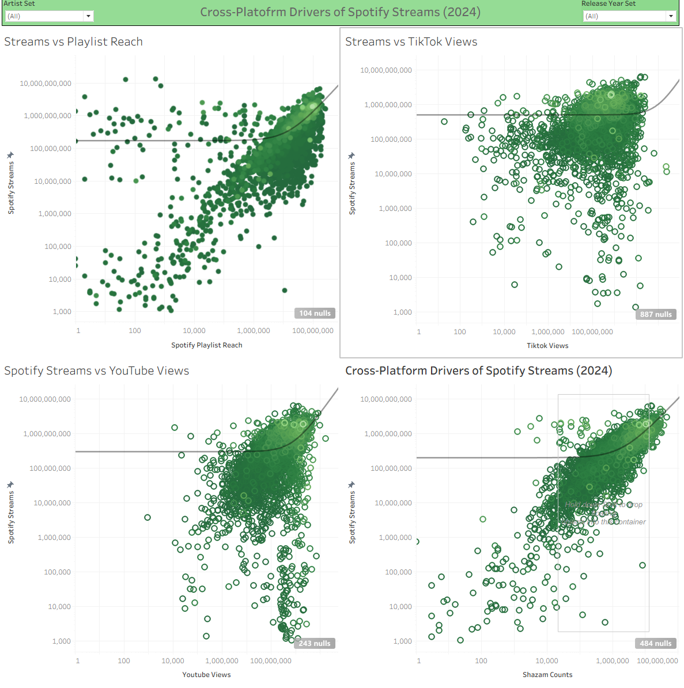

# 🎵 Spotify Cross-Platform Streaming Analysis

> 📌 End-to-end data analysis project:
> Data cleaning → Exploratory analysis → Statistical modelling → Business insights

---

## 📚 Table of Contents

- [Executive Summary](#-executive-summary)
- [Project Objectives](#-project-objectives)
- [Data Source](#-data-source)
- [Tools Used](#-tools-used)
- [Methodology](#-methodology)
- [Statistical Results](#-statistical-results)
- [Key Insights](#-key-insights)
- [Final Insight](#-final-insight--what-drives-top-streaming-performance)
- [Project Structure](#-project-structure)
- [Notebooks](#-notebooks)
- [Tableau Dashboard](#-tableau-dashboard)
- [Author](#-author)

---

## 📌 Executive Summary

This project analyses cross-platform engagement signals (Spotify playlists, TikTok, YouTube and Shazam) to determine which factors most strongly influence Spotify streaming performance.

Using statistical modelling and regression analysis, the results show:

- Playlist reach is a major growth driver.
- Shazam counts are the strongest predictor of streaming volume.
- TikTok views alone do not reliably convert into sustained streams.
- Multi-platform exposure outperforms single-platform spikes.

---

## 🎯 Project Objectives

This project investigates whether cross-platform engagement metrics are statistically associated with Spotify streaming success.

Key questions explored:

- Does playlist exposure significantly increase Spotify streams?
- Does TikTok virality convert into measurable streaming growth?
- Is YouTube engagement a reliable predictor?
- Does Shazam activity reflect real listener demand?
- Which platform shows the strongest statistical relationship?

---

## 📁 Data Source

Dataset: **Most Streamed Spotify Songs 2024**

The dataset contains:

- 4,600 tracks
- 29 variables
- Cross-platform engagement metrics
- Playlist exposure indicators
- Streaming counts
- Search behaviour signals

---

## 🛠 Tools Used

- Python (Pandas, NumPy)
- Matplotlib
- Seaborn
- Jupyter Notebook
- Tableau
- Git & GitHub

---

## 📊 Methodology

### 1️⃣ Data Cleaning  
➡ Implemented in:  
[01_data_loading_and_cleaning_CLEANED.ipynb](./notebooks/01_data_loading_and_cleaning_CLEANED.ipynb)

- Removed duplicate records (kept highest streamed version)
- Converted numeric fields from string format
- Standardised column naming
- Preserved missing values for transparency
- Converted date columns
- Exported cleaned dataset for Tableau

---

### 2️⃣ Exploratory Data Analysis (EDA)  
➡ Implemented in:  
[02_spotify_eda.ipynb](./notebooks/02_spotify_eda.ipynb)

- Distribution analysis
- Log transformations for skewed variables
- Correlation matrix analysis
- Regression modelling
- R² comparison across platforms
- Top 10 vs overall performance comparison

---

## 📊 Statistical Results

| Platform         | R² Value | Interpretation        |
|------------------|----------|------------------------|
| Playlist Reach   | 0.28     | Moderate relationship  |
| TikTok Views     | 0.003    | Very weak relationship |
| YouTube Views    | 0.22     | Moderate relationship  |
| Shazam Counts    | 0.48     | Strong relationship    |

---

## 🔎 Key Insights

### 🎧 Playlist Reach
Strong positive relationship. Tracks with higher playlist exposure tend to generate significantly more Spotify streams.

### 📺 YouTube Engagement
Moderate relationship. Consistent cross-platform presence supports streaming growth.

### 🎥 TikTok
Statistically weak relationship. Viral views do not consistently translate into sustained streaming performance.

### 🔍 Shazam Activity
Strongest predictor of streaming volume. Search behaviour reflects genuine listener intent and demand.

---

## 📈 Final Insight — What Drives Top Streaming Performance

The Top 10 streamed tracks significantly outperform the dataset average across all exposure metrics:

- ~8x higher average Spotify streams  
- ~5x higher playlist reach  
- ~3–4x higher TikTok views  

This suggests that sustained multi-platform exposure — particularly playlist placement and listener search behaviour — plays a critical role in streaming success.

However, correlation does not imply causation. Exposure may amplify already strong-performing tracks rather than directly cause success.

---

## 📂 Project Structure
```
spotify-music-popularity-analysis/
│
├── data/
│ ├── raw/
│ └── processed/
│
├── notebooks/
│ ├── 01_data_loading_and_cleaning_CLEANED.ipynb
│ └── 02_spotify_eda.ipynb
│
├── images/
│ └── images/
│ └── dashboard_overview.png
│
├── tableau/
├── outputs/
└── README.md
```


---

## 📓 Notebooks

- 🔹 [01 — Data Loading & Cleaning](./notebooks/01_data_loading_and_cleaning_CLEANED.ipynb)
- 🔹 [02 — Exploratory Data Analysis](./notebooks/02_spotify_eda.ipynb)

Each notebook is documented and can be run sequentially.

---

## 📊 Tableau Dashboard



---

## 👤 Author

**Ilias Prevyzis**  
Data Analyst | Python | SQL | Tableau
